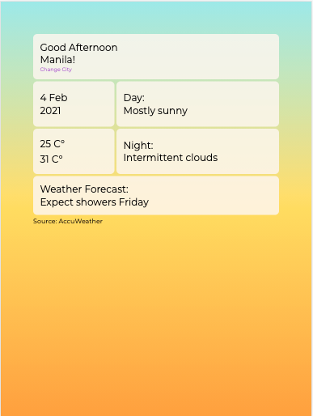
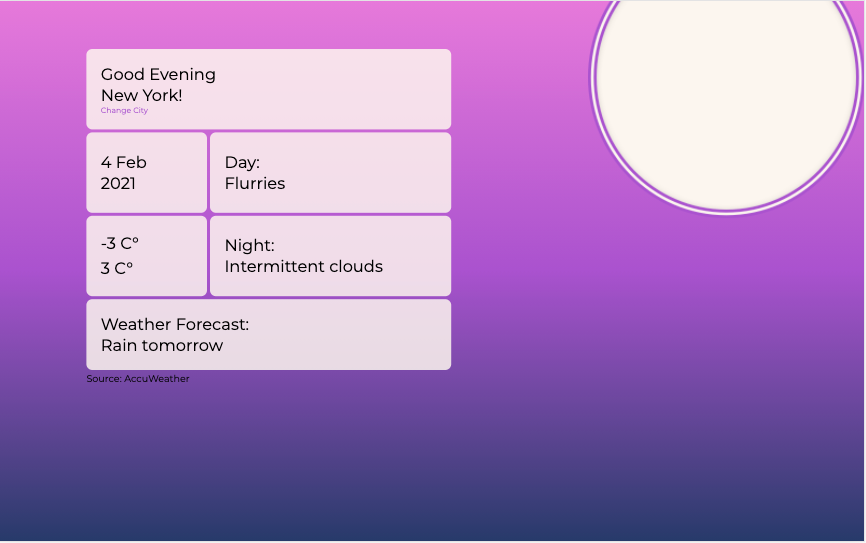

# Project: Weather Today

## Objectives:
1. Use APIs
2. Practice using async and await

## Features:

- Show the current date of a city
- Show the current minimum and maximum temperature of a city
- Show the Day and night weather conditions of a city
- Show the weather forecast of a city

## APIs sources:

### Accuweather 

https://developer.accuweather.com/

### Worldtimeapi

http://worldtimeapi.org/

## Responsive Design

### Mobile

### Ipad 

### Desktop

## Live Preview:

https://liampc.github.io/weather-today/

